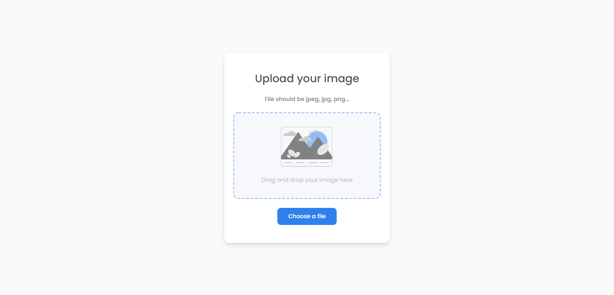

# Fullstack_challenges
 Challenges to be certificated as a fullstack developer by <a href="https://devchallenges.io/">devchallenges.io</a>


## 1. Image Uploader


### How to install

1. Clone this repository
2. Open the repository in a command prompt and type ```cd Image_uploader/backend```
3. Run ```npm install``` and ```npm run dev``` to initialize the server on ``http://localhost:3001``
4. Open a new command prompt and type ```cd Image_uploader/frontend```
5. Run ```npm install``` and ```npm start``` to initialize the application on ``http://localhost:3000``


### Challenge: 

Create an Image Uploader application. 

Use any front-end libraries of your choice. 

Create your API. Don’t look at the existing solution.

### Fulfill user stories below:
```
User story: I can drag and drop an image to upload it
User story: I can choose to select an image from my folder
User story: I can see a loader when uploading
User story: When the image is uploaded, I can see the image and copy it
User story: I can choose to copy to the clipboard 
```
#### More information in: https://devchallenges.io/challenges/O2iGT9yBd6xZBrOcVirx
